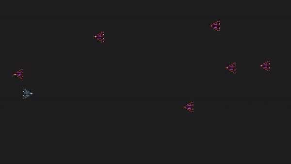

#This is a c++ version of a shooter game after I followed the steps on [a sdl2 beginner's tutorials](https://www.parallelrealities.co.uk/tutorials/)



## all classes

```
Entity   ---  a base class for all the objects on the screen, a bullet, a plane, a enemy plane ...
Plane    ---  a second base class for FighterPlane and AlinePlane
FighterPlane --- the player's plane
AlienPlane  --- an enemy plane which represents the aliens
Bullet      --- bullets fire from the player
Game        --- handle all the logic update the objects positions and other attributes    
Controller  --- update the player's and alienPlane's position and bullets ...
Renderer    --- render all the above information on the screen
```

## Dependencies for Running Locally
* SDL2 >= 2.0
* Only SDL2 x64 lib can run normally on my machine
* Windows: recommend using Visual Studio 2017

## Base Build Instructions
* Open the Project using Visual Studio 2017
* Set the SDL2 library and headers correctly
* Run the project


## A little Conclusion
From this tutorials I realy leaned a lot about SDL2 on game programming and c++ programming, though I admit the code has great space to optimization
When I follow the totorial coding the shooter game, I find it is really interesting.
I think I will learn more about C++ and game programming after this course. 
Thanks everybody on Udacity, I really enjoyed this course and benefited a lot. 